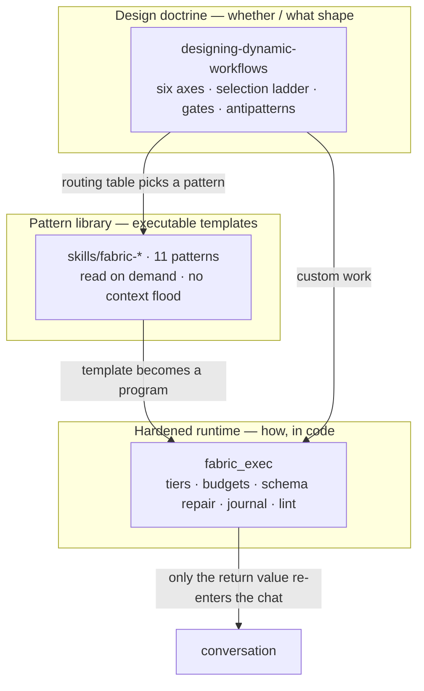

# pi-fabric (fork)

> A fork of **[monotykamary/pi-fabric](https://github.com/monotykamary/pi-fabric)** — one `fabric_exec` tool that lets the [Pi](https://github.com/earendil-works/pi-coding-agent) coding agent write type-checked TypeScript against its own capabilities, instead of orchestrating one tool call at a time. All credit for the runtime foundation goes to Tom ([@monotykamary](https://github.com/monotykamary)); read the [upstream README](https://github.com/monotykamary/pi-fabric) for the origin story and core architecture.

This fork layers two things on top of upstream: **runtime hardening** (tiering, budgets, structured-output repair, journaled replay, program linting) and a **library of dynamic-workflow skill patterns**. Everything here stays **vendor-neutral** — Pi runs many models at many reasoning levels, so nothing couples to a specific provider or hardcodes model IDs; reasoning depth flows only through Pi's generic effort/thinking levels.

The design principles behind all of it live in the companion doctrine repo, **[designing-dynamic-workflows](https://github.com/haziqazizi/designing-dynamic-workflows)**.

## Why this fork

Upstream fabric answers *"how does the model orchestrate?"* — one `fabric_exec` tool, code instead of a stack of tool calls. This fork answers the operational questions that surface once you actually run it across many models and long sessions:

- **Mixed models, no lock-in.** Pi runs many providers at many reasoning levels. Everything here is vendor-neutral: route cost with `tier: small|medium|big` (ranked by *price*, not a hardcoded model list), and reach for a cross-provider panel when one family's blind spots would cost you.
- **Long runs that don't hurt.** Journaled replay (`journalKey`) means a crashed 50-item fan-out re-pays only for what changed; reserve-then-settle budgets close the concurrent-spawn overshoot that makes "just add more agents" expensive.
- **Failures that don't lie.** Bounded schema repair turns "the model never emitted valid output" into a terminal, non-retried error instead of a silent stall; the quality helpers (`verify` / `gate` / …) return exhaustion *visibly* rather than dressing it up as success.
- **Patterns that dodge the traps.** The skill library encodes verification-first patterns — refute-don't-confirm verify, cross-provider panels, the selection ladder, trajectory audits against the run transcript — so you aren't re-deriving the correlated-error antipatterns each time.

Use this fork if you're running multi-agent work on Pi across mixed models and want cost control, resumability, and verification rigor — without coupling any of it to a specific provider.

## How the pieces fit

Three layers: the doctrine decides *whether and what shape*, the pattern library provides *executable templates*, and the hardened runtime provides *the API to run them*. The model reaches the patterns on demand — its always-on surface stays minimal.

---

## Runtime improvements (`src/`)

Six additions to the core runtime, each model-agnostic and test-covered (full suite green, 1,165 tests):

| Feature | What it does |
|---|---|
| **Model tiers** | `tier: "small" \| "medium" \| "big"` on any agent call, resolved against the user's *actual* configured models by **price-first ranking** — robust to novel vendor names, with no-collapse/no-inversion guards and no hardcoded model IDs. Route cheap work to cheap models without naming them. |
| **Bounded schema repair** | When a subagent with a JSON schema never emits valid structured output, the worker re-prompts the live session up to `maxSchemaRetries` times, then tries strict host-side extraction, then fails with a terminal `schema_noncompliance` error that **bypasses retries by design** (a retry just repeats the failure at full cost). |
| **Reserve-then-settle budgets** | The cost ledger now reserves an estimate at spawn and settles the actual on completion, closing the concurrent-spawn overshoot race. New `budgetEnforcement: "hard"` stops running children once settled + reserved reaches the ceiling; `"soft"` (default) preserves exact current behavior. |
| **Quality-pattern helpers** | `verify`, `judgePanel`, `loopUntilDry`, and `gate` as guest globals — adversarial-vote verification, judge panels, loop-until-dry discovery, and bounded semantic retry — with **visible-failure semantics** (exhaustion is returned, never thrown away or dressed up as success). |
| **Journaled replay** | Opt-in `journalKey` on `fabric_exec` gives **content-keyed** resume: re-running replays completed agent results and re-pays only for new or changed calls. A determinism guard (throw on `Math.random`/`Date.now` when journaling) makes replay sound — and is inert when journaling is off. |
| **LID lint** | Advisory type-check warnings (never fatal) when an authored program inlines an oversized prompt or collapses to a single undecomposed agent call — nudging programs toward small, locally-in-distribution calls. |

## Skill patterns (`skills/`)

Advanced multi-agent patterns as user-invoked skills, each a type-checked `fabric_exec` program. Advanced patterns are user-invoked and are not advertised for automatic selection — only `fabric-exec` (the core reference) is model-invoked; the rest are user-opt-in (`disable-model-invocation: true`). Invoke `/skill:fabric-guide` to have it recommend the smallest sufficient one.

- **fabric-workflow** — discover → fan-out → verify, with per-role effort routing and three-way (confirmed / plausible / refuted) verification verdicts
- **fabric-council** — a reviewer panel differentiated *structurally* (different briefs, evidence, tools), not by persona labels
- **fabric-fusion** — a cross-provider model panel with judge-bias guards (the judge is pulled from outside the panel where possible)
- **fabric-select** — the selection ladder: external check → order-swapped pairwise → per-criterion veto → graft the losers' best parts
- **fabric-optimize** — an evaluator-optimizer loop with champion tracking and fresh-context retry, so a later worse attempt can't ship
- **fabric-trajectory-judge** — audits an agent's *process* against its run transcript, catching fabricated evidence and unverified "done" claims
- **fabric-resume** — a content-keyed journaled fan-out that survives interruption and re-pays only for changed items
- **fabric-postmortem** — a self-curating "field guide": stigmergic memory that turns a run's surprises into durable, budget-capped steering the next run reads
- **fabric-orchestrate** — delegates orchestration authorship to a fresh recursive child, keeping the author call locally-in-distribution late in long sessions
- **fabric-integrate** — a neutral third-party resolver that merges the branches from a worktree fan-out behind a build/test gate
- **fabric-guide** — a router that recommends the smallest sufficient pattern and never runs it

## Install

This is still pi-fabric — see the [upstream README](https://github.com/monotykamary/pi-fabric) for the base runtime and its published npm package.

To run this fork's additions, install it straight from git. A `prepare` hook builds `dist/` on install, so there's no manual build step:

- As a Pi extension: `pi install git:github.com/haziqazizi/pi-fabric`
- As a pinned package dependency: `"pi-fabric": "git+https://github.com/haziqazizi/pi-fabric.git#<commit>"`

The [pi-haziq](https://github.com/haziqazizi/pi-haziq) package wires it in this way, registering the whole `skills/` directory so `/skill:fabric-guide` and the patterns are user-invocable.

## Relationship to upstream

A **divergent fork**, maintained independently. It may pull upstream fixes but does not track `main`. The runtime foundation, its architecture, and the design story are Tom's work at [monotykamary/pi-fabric](https://github.com/monotykamary/pi-fabric); this fork adds the hardening and skill patterns above. If a change here proves generally useful, it's a candidate to send upstream.

## License

MIT, same as upstream. Copyright for the base runtime remains © 2026 monotykamary; see [LICENSE](./LICENSE).
